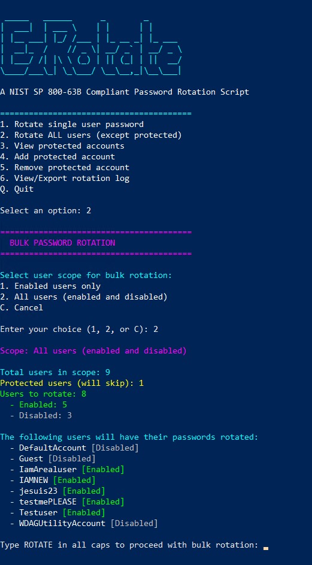
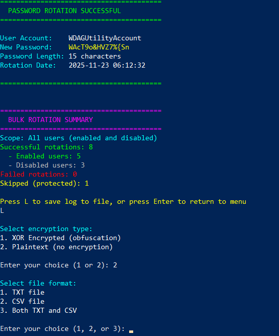
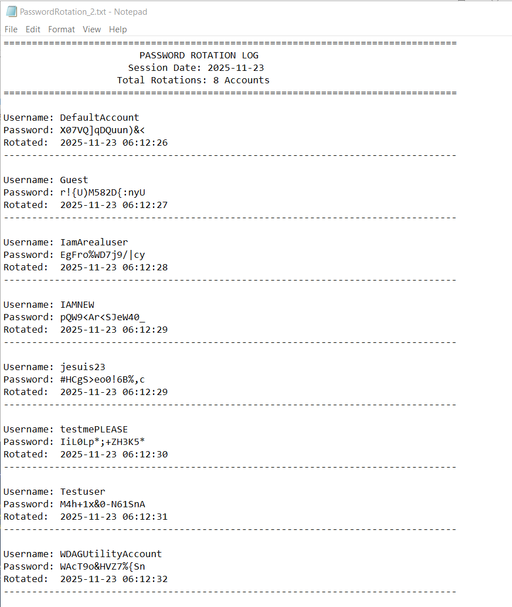
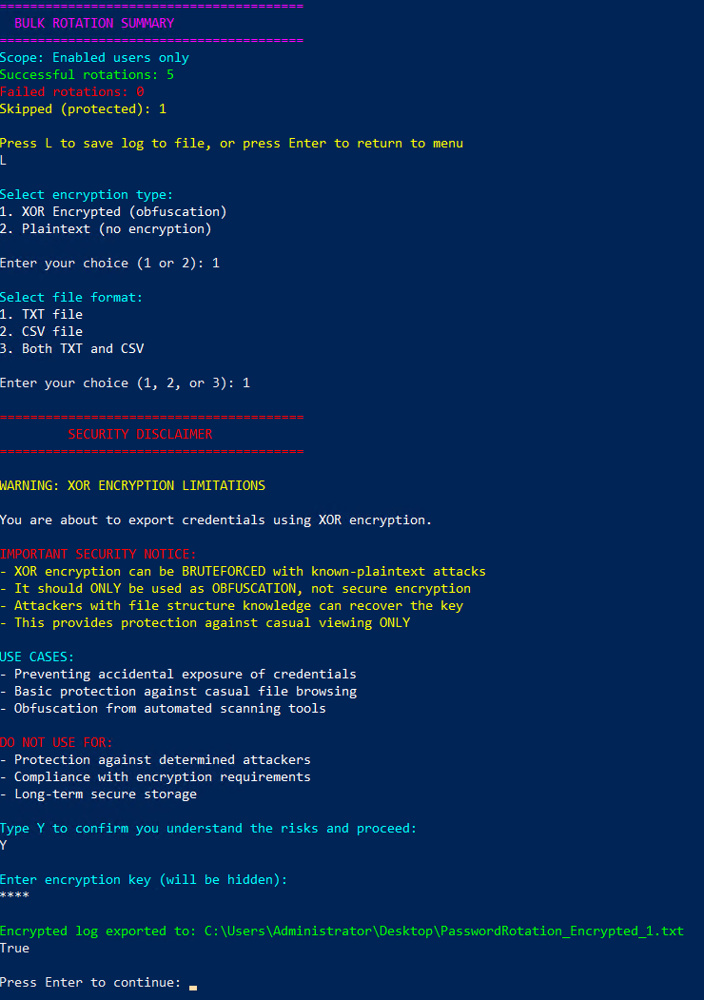
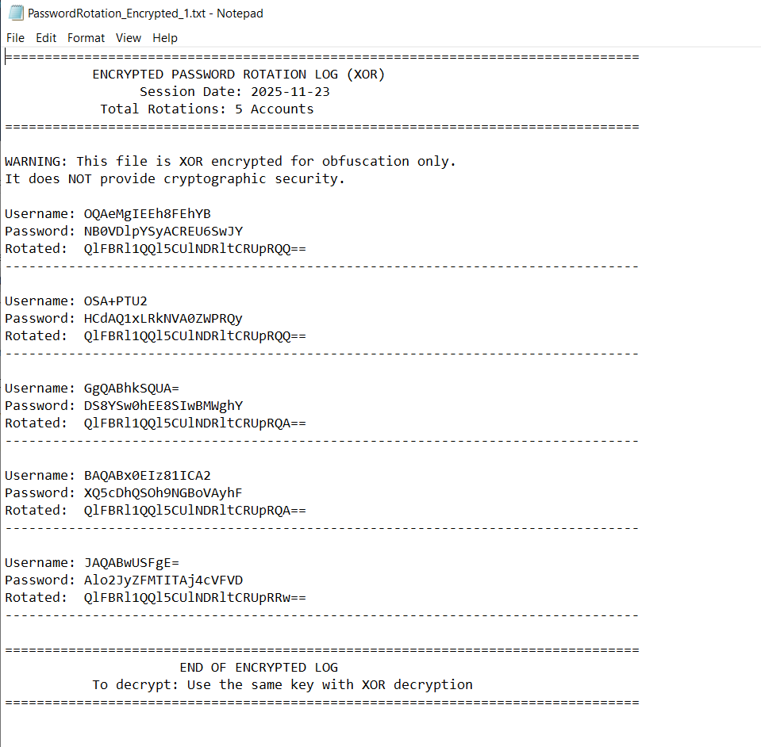
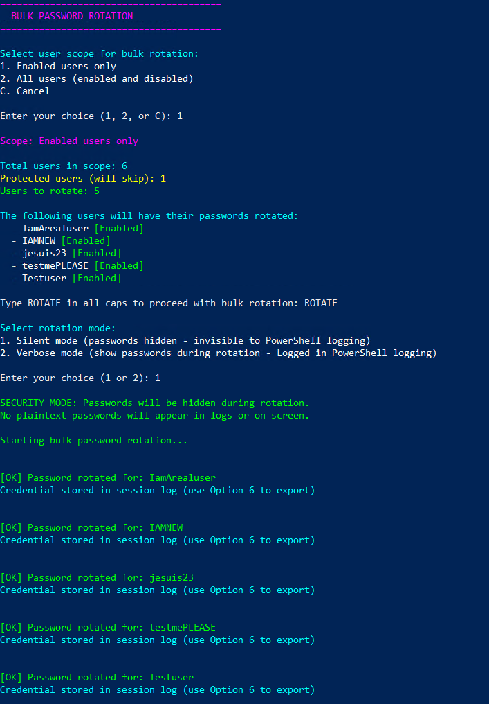

# EzRotate

```
 _____   ______      _        _       
|  ___|  | ___ \    | |      | |      
| |__ ___| |_/ /___ | |_ __ _| |_ ___ 
|  __|_  /    // _ \| __/ _` | __/ _ \
| |___/ /| |\ \ (_) | || (_| | ||  __/
\____/___\_| \_\___/ \__\__,_|\__\___|
```

**A NIST SP 800-63B Compliant Password Rotation Script for Windows**

EzRotate is a PowerShell-based password rotation tool designed to help system administrators securely manage and rotate local Windows user account passwords in compliance with NIST SP 800-63B guidelines.

## 🔐 Features

- **Secure Password Generation**: Generates 15-character passwords with uppercase, lowercase, numbers, and special characters
- **Bulk Rotation**: Rotate passwords for all users or individual accounts
- **Protected Accounts**: Safeguard critical accounts (like Administrator) from bulk rotation
- **Multiple Export Options**: Export rotation logs in plaintext or XOR-encrypted formats
- **Session Logging**: Track all password rotations performed during a session
- **Interactive Menu**: User-friendly command-line interface
- **Silent & Verbose Modes**: Choose between silent rotation (passwords hidden) or verbose mode (passwords shown during rotation)
- **NIST Compliance**: Follows NIST SP 800-63B password requirements

## 📋 Requirements

- Windows operating system
- PowerShell 5.1 or higher
- Administrator privileges
- Local user accounts (not domain accounts)

## 🚀 Quick Start

1. Download `EzRotate.ps1`
2. Open PowerShell as Administrator
3. Navigate to the script directory
4. Run the script:

```powershell
.\EzRotate.ps1
```

## 📸 Screenshots

### Bulk Password Rotation


Rotate passwords for multiple users at once with scope options (enabled users only or all users). The script provides real-time feedback on successful rotations, failures, and protected accounts.

### Rotation Summary and Export Options


After bulk rotation, view a summary of successful rotations, failed attempts, and skipped protected accounts.
Choose between XOR encrypted exports (for obfuscation) or plaintext exports, with options for TXT files, CSV files, or both.

### Plaintext Log Output


Plaintext logs provide clear, readable records of password rotations with timestamps for audit purposes.

### XOR Roatation Summary


XORs the rotated credentials by a XOR key input specified by the user.  (Disclaimer: This can be bruteforced and is only a mild form of security)

### XOR Log Output


"Encrypted" logs use XOR encryption with Base64 encoding for credential obfuscation, protecting against casual viewing.
### Silent Password Rotation


Rotates credentials without outputting pertinent information to console avoiding powershell logging detection.

## 🔧 Usage

### Rotate a Single User Password

1. Select option `1` from the main menu
2. Choose between:
   - **Silent mode**: Password rotated without displaying on screen
   - **Verbose mode**: New password displayed after rotation
3. Enter the username
4. Password will be automatically generated and applied

### Bulk Rotate All Users

1. Select option `2` from the main menu
2. Choose scope:
   - **Enabled users only**: Only rotate passwords for active accounts
   - **All users (enabled and disabled)**: Rotate all local user accounts
3. Confirm rotation by typing `ROTATE` in all caps
4. Choose rotation mode:
   - **Silent mode**: Passwords hidden during rotation (secure for logging)
   - **Verbose mode**: Passwords shown during rotation (logged in PowerShell transcripts)

### Manage Protected Accounts

Protected accounts are excluded from bulk rotation operations to prevent accidental lockouts.

- **View Protected Accounts** (Option 3): List all currently protected accounts
- **Add Protected Account** (Option 4): Add an account to the protection list
- **Remove Protected Account** (Option 5): Remove an account from the protection list

By default, the `Administrator` account is protected.

### View and Export Rotation Logs

Select option `6` to access rotation logs for the current session.

#### Export Options:

**1. Encrypted Export (XOR)**
- Passwords are XOR encrypted with a user-provided key
- Base64 encoded for additional obfuscation
- Prevents accidental exposure in logs or file browsing
- **Note**: XOR encryption is for obfuscation only, not cryptographic security
- Includes comprehensive security disclaimer before export

**2. Plaintext Export**
- Passwords displayed and exported in readable format
- Useful for immediate credential distribution
- Includes security warnings about PowerShell transcript logging
- Options for TXT, CSV, or both formats

#### Export Formats:

- **TXT**: Human-readable text file with formatted output
- **CSV**: Spreadsheet-compatible format for easy import into password managers
- **Both**: Creates both TXT and CSV files simultaneously

## 🔒 Security Considerations

### XOR Encryption Limitations

The script uses XOR encryption for log obfuscation, which:

✅ **Good for:**
- Preventing accidental credential exposure
- Basic protection against casual file browsing
- Obfuscation from automated scanning tools

❌ **NOT suitable for:**
- Protection against determined attackers
- Compliance with encryption requirements
- Long-term secure storage

The script provides explicit warnings when using XOR encryption.

### Plaintext Export Warnings

When exporting in plaintext, be aware:

- Passwords will be displayed on screen
- PowerShell transcript logging will capture passwords
- Screen recording/sharing will expose credentials
- Risk of shoulder surfing in shared environments

### Best Practices

1. **Run in a secure environment**: Ensure no screen sharing or recording is active
2. **Disable transcript logging**: Consider disabling PowerShell transcript logging before plaintext operations
3. **Use encrypted exports when possible**: Default to XOR encryption for routine log exports
4. **Secure log files**: Store exported log files in secure locations with appropriate access controls
5. **Rotate regularly**: Establish a regular password rotation schedule
6. **Test before bulk operations**: Test single user rotation before bulk operations
7. **Maintain protected accounts**: Always keep at least one administrator account protected

## 📊 Password Generation

Passwords generated by EzRotate meet NIST SP 800-63B requirements:

- **Length**: 15 characters
- **Complexity**: 
  - At least 1 uppercase letter (A-Z)
  - At least 1 lowercase letter (a-z)
  - At least 1 number (0-9)
  - At least 1 special character (!@#$%^&*()_-+={}[]|:;<>,.?/)
- **Randomization**: Cryptographically shuffled for unpredictability

## 🛡️ NIST SP 800-63B Compliance

EzRotate follows NIST SP 800-63B guidelines for password security:

- Generates passwords with sufficient entropy
- Uses appropriate character sets
- Avoids predictable patterns
- Supports secure password storage practices

Reference: [NIST SP 800-63B Digital Identity Guidelines](https://pages.nist.gov/800-63-3/sp800-63b.html)

## 📝 Log Files

Log files are automatically saved to the desktop with sequential numbering:

- **Encrypted TXT**: `PasswordRotation_Encrypted_1.txt`, `PasswordRotation_Encrypted_2.txt`, etc.
- **Encrypted CSV**: `PasswordRotation_Encrypted_1.csv`, `PasswordRotation_Encrypted_2.csv`, etc.
- **Plaintext TXT**: `PasswordRotation_1.txt`, `PasswordRotation_2.txt`, etc.
- **Plaintext CSV**: `PasswordRotation_1.csv`, `PasswordRotation_2.csv`, etc.

## ⚠️ Important Notes

- This script only works with **local Windows user accounts**
- **Domain accounts are not supported**
- Requires **Administrator privileges** to run
- Password changes take effect immediately
- Users will need to use their new passwords on next login
- Session logs are cleared when the script exits
- Protected account list persists only during script execution

## 🤝 Contributing

Contributions are welcome! Please feel free to submit pull requests or open issues for bugs and feature requests.
